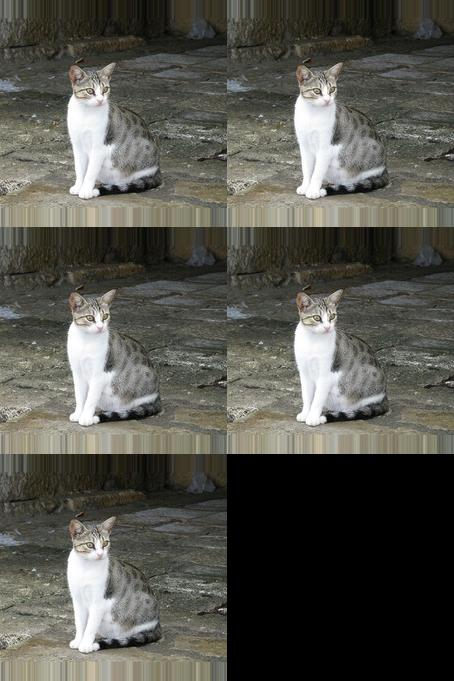
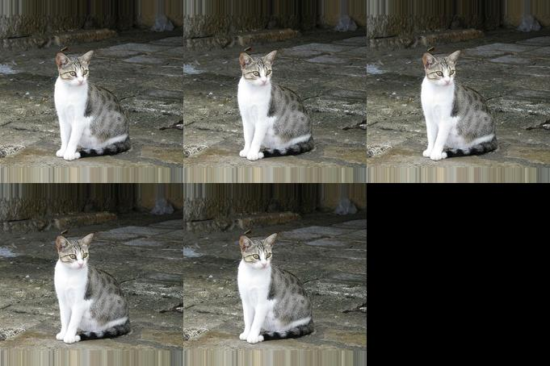
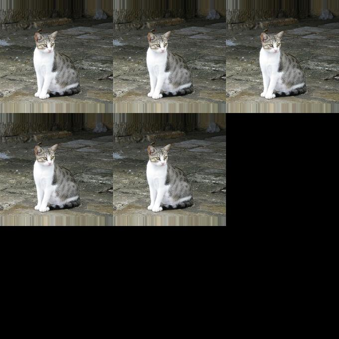

# scode

scode is my personal code library. 

## mosaic

mosaic.py contains code to mosaic images. Simply call it by running the following:

	python mosaic.py input_directory output_directory output_filename num_rows num_cols

Sample Images:

	

